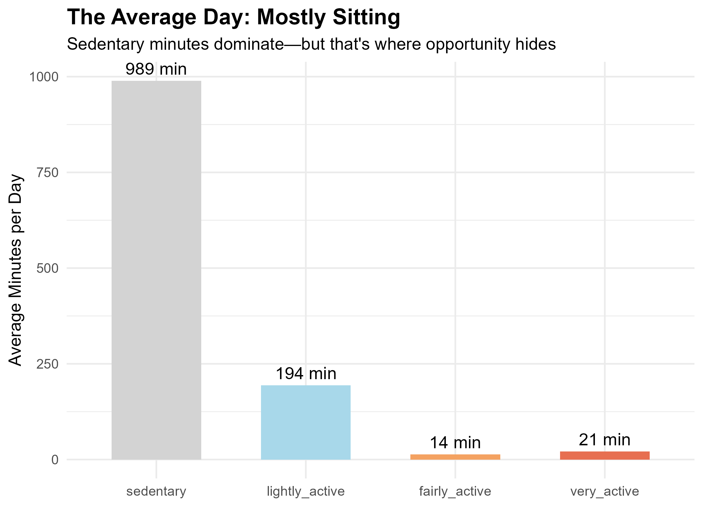
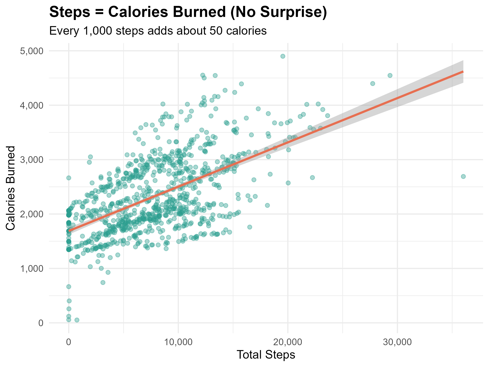
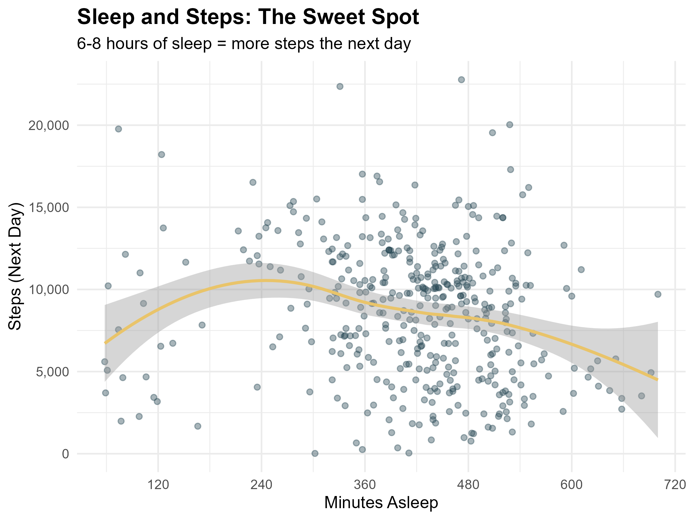
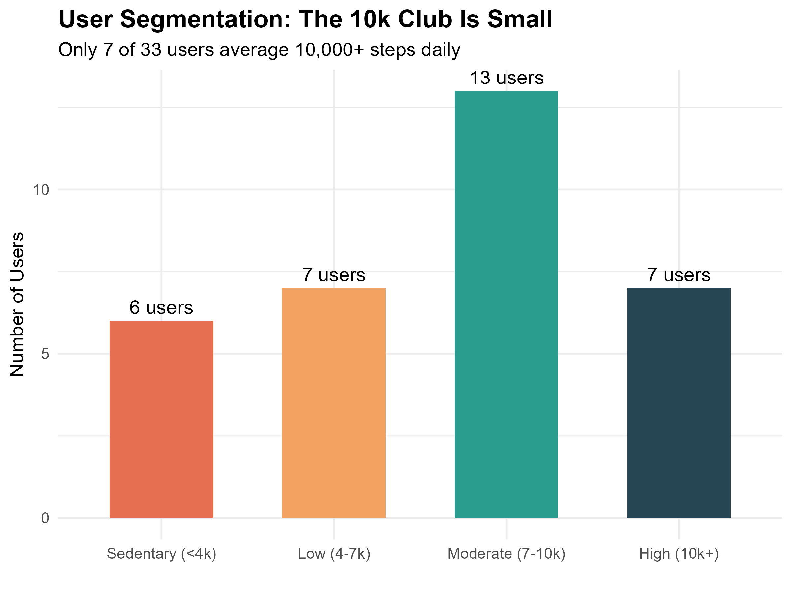
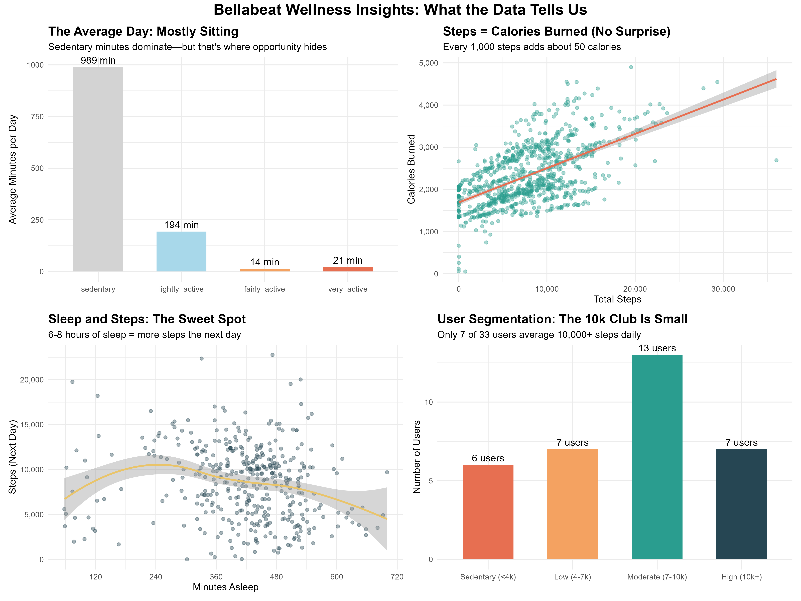

# Bellabeat Wellness Analysis: Strategic Insights from Fitness Tracker Data

**Analyst:** Oluwasijibomi Oderinde  
**Date:** April 2026  
**Tools:** SQL (DB Browser for SQLite) | R (tidyverse, ggplot2, patchwork)

---

## Executive Summary

This analysis examines 33 FitBit users' daily activity and sleep data (March–May 2016) to identify behavioral trends applicable to Bellabeat's wellness product marketing strategy. The goal was to uncover actionable insights that could inform customer engagement, feature prioritization, and messaging for Bellabeat's Leaf, Time, and Spring product lines.

**Key Findings:**
- Users average **16.5 sedentary hours per day**, representing an opportunity for well-timed engagement nudges.
- A positive correlation exists between **6–8 hours of sleep and next-day step counts**, validating sleep tracking as a core value proposition.
- Only **21% of users** achieve the commonly cited 10,000-step benchmark; most fall within the 4,000–10,000 range.

**Recommendations Summary:**
1. Implement intelligent sedentary alerts to increase daily app engagement.
2. Position sleep tracking as a performance enhancer for daytime activity.
3. Segment user communications based on activity bands rather than applying a universal benchmark.

---

## Business Context

Bellabeat is a wellness technology company specializing in health-focused products for women. The marketing director seeks to leverage public fitness data to refine the company's go-to-market messaging and feature emphasis.

This analysis addresses the question:

> *"How do consumers engage with wellness trackers, and what behavioral patterns can Bellabeat leverage to differentiate its products and increase user retention?"*

---

## Data Sources and Limitations

**Source:**  
FitBit Fitness Tracker Data, publicly available via Kaggle under a CC0: Public Domain license. The dataset includes 18 CSV files covering daily activity, sleep logs, heart rate, weight, and step records from 33 consenting users.

**Time Period:** March 12, 2016 – May 12, 2016 (31 days)

**Acknowledged Limitations:**
- Sample size (n=33) is insufficient for statistical generalization.
- Data is not current (2016) and may not reflect recent fitness tracker adoption patterns.
- No demographic or psychographic variables are available.

Despite these constraints, the dataset provides **directional indicators** suitable for hypothesis generation and initial strategic guidance. Any findings should be validated against Bellabeat's proprietary user data before full-scale implementation.

---

## Repository Structure

---

## Data Processing Methodology

### SQL (Data Assembly and Initial Cleaning)

The raw CSV files were imported into a SQLite database using DB Browser for SQLite. The following transformations were applied:

- Removal of records with null user IDs.
- Filtering of days with zero steps and zero calories (indicating non-wear).
- Creation of cleaned tables for `daily_activity` and `sleep` with standardized column naming.
- Verification of record counts and unique user identifiers.

**Script:** `scripts/01_data_assembly.sql`

### R (Exploratory Analysis and Visualization)

Cleaned data was imported into R for further processing and visualization. Key steps included:

- Date parsing and formatting using `lubridate`.
- Calculation of average daily active minutes by intensity level.
- Linear regression to quantify the steps-to-calories relationship.
- Loess smoothing to visualize the non-linear relationship between sleep duration and next-day activity.
- User segmentation based on average daily step counts.

**Script:** `scripts/02_bellabeat_analysis.R`

---

## Key Findings and Supporting Visualizations

### Finding 1: Sedentary Behavior Dominates Daily Activity

The average user spends approximately **990 minutes (16.5 hours)** in a sedentary state each day. Lightly active minutes account for the next largest share, while moderate and vigorous activity are minimal.

**Strategic Implication:**  
Rather than focusing exclusively on high-intensity fitness, Bellabeat's app experience should incorporate gentle, context-aware nudges that encourage brief movement breaks. This positions the product as a holistic wellness companion rather than a pure fitness tracker.

---

### Finding 2: Steps Strongly Predict Caloric Expenditure

A linear relationship exists between total daily steps and calories burned. Each additional **1,000 steps** corresponds to approximately **50 additional calories** expended.

**Strategic Implication:**  
This metric is highly communicable. Marketing copy can translate abstract step goals into relatable equivalents (e.g., "Today's steps earned you a latte"). This makes the value of activity tangible for users who are not fitness enthusiasts.

---

### Finding 3: Sleep Duration Correlates with Next-Day Activity

Users who sleep **6–8 hours** (360–480 minutes) demonstrate measurably higher step counts the following day. Both insufficient sleep (<5 hours) and excessive sleep (>9 hours) correlate with reduced activity.

**Strategic Implication:**  
This finding reinforces the interconnected nature of wellness behaviors. Bellabeat should emphasize the **performance benefits** of sleep tracking—not just as a recovery metric, but as a predictor of daytime energy and activity. The Leaf's sleep tracking capability should be positioned as a productivity and energy management tool.

---

### Finding 4: Activity Levels Vary Significantly Across Users

Segmenting users by average daily steps reveals that only **7 of 33 users (21%)** consistently exceed the 10,000-step benchmark. The majority fall within the 4,000–10,000 step range, with a small sedentary cohort below 4,000 steps.

**Strategic Implication:**  
Applying a universal 10,000-step goal may alienate or demotivate a significant portion of the user base. Bellabeat should adopt **personalized goal-setting** based on individual baselines and celebrate incremental progress (streaks, personal bests) rather than enforcing a one-size-fits-all standard.

---

## Combined Dashboard

---

## Strategic Recommendations

The following recommendations are derived from the analysis and are intended for evaluation by Bellabeat's marketing and product teams.

| Priority | Recommendation | Supporting Insight | Expected Impact |
|:--------:|----------------|-------------------|-----------------|
| 1 | **Implement Intelligent Sedentary Alerts** | Users average 16.5 sedentary hours daily. | Increases daily active usage (DAU) and positions Bellabeat as a proactive wellness partner. |
| 2 | **Position Sleep as an Energy Multiplier** | 6–8 hours of sleep correlates with higher next-day activity. | Differentiates Leaf's sleep tracking from competitors by framing it as a performance enhancer, not just recovery. |
| 3 | **Segment Email and Notification Flows by Activity Band** | User activity clusters into distinct bands (sedentary, low, moderate, high). | Improves engagement rates by delivering relevant, attainable challenges to each user segment. |
| 4 | **Adopt Relatable Activity Translations in Marketing** | 1,000 steps ≈ 50 calories. | Makes abstract metrics tangible for casual users through food/activity equivalents in social content. |

---

## Recommendations for Further Analysis

Should additional data become available, the following avenues merit investigation:

- **Weather Data Integration:** Assess whether inclement weather disproportionately affects step counts among Bellabeat's target demographic, informing seasonal campaign timing.
- **Heart Rate Variability (HRV) Analysis:** Explore stress and recovery patterns using the available heart rate data (sampled at 5-second intervals).
- **Weight Logging Behavior:** Analyze the frequency and consistency of weight tracking to understand user commitment to long-term health goals.

---

## Technical Implementation Notes

- **SQL Environment:** All SQL operations were performed using SQLite (DB Browser). The `JULIANDAY` function was not required for this dataset as date parsing was handled in R.
- **R Environment:** R version 4.5.3. Primary packages: `tidyverse` (data manipulation), `ggplot2` (visualization), `lubridate` (date handling), `patchwork` (dashboard assembly).
- **Reproducibility:** All scripts are self-contained and documented. Running `scripts/02_bellabeat_analysis.R` will regenerate all figures in the `03_Insights_and_Visuals/` directory.

---

## Contact

**Oluwasijibomi Oderinde**  
Data Analyst

- 💼 [LinkedIn] www.linkedin.com/in/oluwasijibomi-oderinde-b1700724
- 💻 [GitHub] https://github.com/Sijibomi0909
- 📧 [Email] oderindesiji@gmail.com
---

*This case study was completed as part of a professional data analytics portfolio. For inquiries or collaboration opportunities, please reach out via email or LinkedIn.*